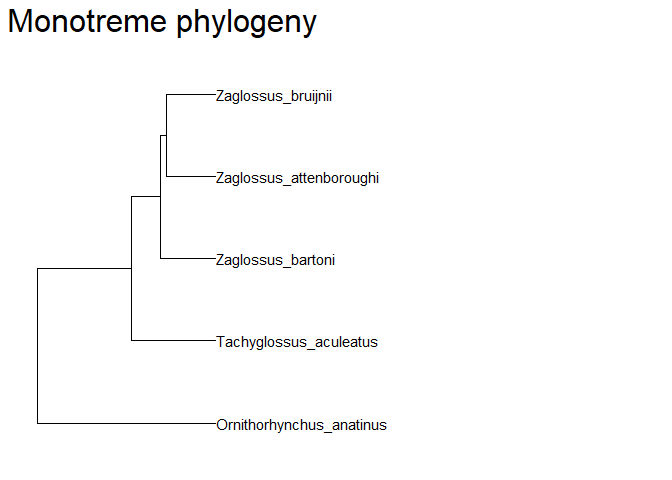
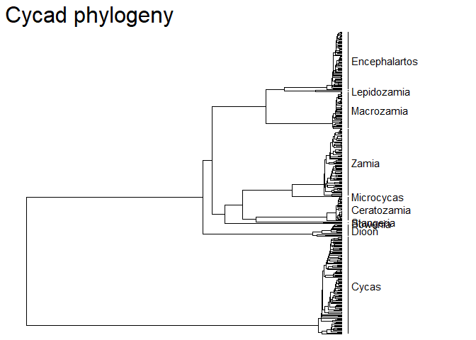

# rEDGE

Package to calculate EDGE scores and more phylogenetic-based indicators
in R


## The EDGE metric

The EDGE metric is an index that aims to prioritize species’
conservation based on both their phylogenetic singularity (i.e. ED,
Evolutionaty Distinctiveness) and their extinction risk (GE, Globally
Endangered). Based on this idea, several methods have been developed in
order to calculate individual EDGE scores.

## General use of `rEDGE` package

This package was aimed to provide a flexible and accessible software for
both researchers and conservation practitioners to include evolutionary
history in conservation planning. Thus, we provide with a set of
functions which allow users to calculate phylogeny-informed metrics
using a variety of parameters. The functions herein included can be
divided in 2 groups, namely EDGE score calculating functions (aimed for
researchers willing to compile an EDGE ranking), and indicator
functions, aimed to report how the conservation of evolutionary history
has evolved in several time frames.

Although flexible with some customisable parameters, the `rEDGE` package
is dependent of two central sets of information. First, it needs
phylogenetic information. This object must be provided as a ‘phylo’ or
‘multiPhylo’ object. Whenever a single (e.g. consensus) phylogeny is
provided, the EDGE metric will be applied to it following the required
parameters. Alternatively, if a ‘multiPhylo’ object is provided, `rEDGE`
will apply the function to each individual tree. Results may be
summarized after if desired. A second imperative object is a data frame
storing Red list assessments for all species in the phylogeny. Besides
these, different parameters may apply in each way of measuring the EDGE
score for the studied species.

In general, each individual way of calculating the EDGE metric has its
own function designed for that specific purpose (see details in the
following sections). Nevertheless, there is a wrapper function
(i.e. `calculate_EDGE()`) which incorporates all specific ones
(e.g. `calculate_EDGE2()` or `calculate_EDGE1_multiphylo()`) by passing
through the same parameters.

To illustrate the differences among methods ant their implementationn
within `rEDGE` package, we will see some examples using monotremates
(i.e. platypus and echidna species) and cycads. We herein use the
monotremate example dataset whenever calculating EDGE scores for a
single tree, while the cycad example will be used to incorporate
multiPhlo trees (there are 10 different phylogenetic hypotheses), as
well as when calculating report indicators (as there are two separate
assessments, performed in 2003 and 2014).

<div style="display: flex;">

<div style="width: 55%;">



</div>

<div style="width: 40%;">

<table class="table" style="font-size: 11px; float: left; margin-right: 10px;">

<caption style="font-size: initial !important;">

Monotreme Red List assessments (IUCN, 2025)
</caption>

<thead>

<tr>

<th style="text-align:center;">

species
</th>

<th style="text-align:left;">

RLcat
</th>

</tr>

</thead>

<tbody>

<tr>

<td style="text-align:center;">

Zaglossus_bartoni
</td>

<td style="text-align:left;">

VU
</td>

</tr>

<tr>

<td style="text-align:center;">

Zaglossus_attenboroughi
</td>

<td style="text-align:left;">

CR
</td>

</tr>

<tr>

<td style="text-align:center;">

Zaglossus_bruijnii
</td>

<td style="text-align:left;">

CR
</td>

</tr>

<tr>

<td style="text-align:center;">

Tachyglossus_aculeatus
</td>

<td style="text-align:left;">

LC
</td>

</tr>

<tr>

<td style="text-align:center;">

Ornithorhynchus_anatinus
</td>

<td style="text-align:left;">

NT
</td>

</tr>

</tbody>

</table>

</div>

</div>

  

<div style="display: flex;">

<div style="width: 55%;">



</div>

<div style="width: 40%;">

<div style="border: 1px solid #ddd; padding: 0px; overflow-y: scroll; height:500px; overflow-x: scroll; width:300px; ">

<table class="table" style="font-size: 11px; width: auto !important; margin-right: 0; margin-left: auto">

<caption style="font-size: initial !important;">

Cycadales Red List assessments

(2003 & 2014)
</caption>

<thead>

<tr>

<th style="text-align:center;position: sticky; top:0; background-color: #FFFFFF;">

species
</th>

<th style="text-align:left;position: sticky; top:0; background-color: #FFFFFF;">

RL_2003
</th>

<th style="text-align:center;position: sticky; top:0; background-color: #FFFFFF;">

RL_2014
</th>

</tr>

</thead>

<tbody>

<tr>

<td style="text-align:center;">

Bowenia_serrulata
</td>

<td style="text-align:left;">

LC
</td>

<td style="text-align:center;">

LC
</td>

</tr>

<tr>

<td style="text-align:center;">

Bowenia_spectabilis
</td>

<td style="text-align:left;">

LC
</td>

<td style="text-align:center;">

LC
</td>

</tr>

<tr>

<td style="text-align:center;">

Ceratozamia_alvarezii
</td>

<td style="text-align:left;">

EN
</td>

<td style="text-align:center;">

EN
</td>

</tr>

<tr>

<td style="text-align:center;">

Ceratozamia_becerrae
</td>

<td style="text-align:left;">

EN
</td>

<td style="text-align:center;">

EN
</td>

</tr>

<tr>

<td style="text-align:center;">

Ceratozamia_brevifrons
</td>

<td style="text-align:left;">

VU
</td>

<td style="text-align:center;">

VU
</td>

</tr>

<tr>

<td style="text-align:center;">

Ceratozamia_chimalapensis
</td>

<td style="text-align:left;">

EN
</td>

<td style="text-align:center;">

EN
</td>

</tr>

<tr>

<td style="text-align:center;">

Ceratozamia_decumbens
</td>

<td style="text-align:left;">

VU
</td>

<td style="text-align:center;">

CR
</td>

</tr>

<tr>

<td style="text-align:center;">

Ceratozamia_euryphyllidia
</td>

<td style="text-align:left;">

CR
</td>

<td style="text-align:center;">

CR
</td>

</tr>

<tr>

<td style="text-align:center;">

Ceratozamia_fuscoviridis
</td>

<td style="text-align:left;">

CR
</td>

<td style="text-align:center;">

CR
</td>

</tr>

<tr>

<td style="text-align:center;">

Ceratozamia_hildae
</td>

<td style="text-align:left;">

EN
</td>

<td style="text-align:center;">

EN
</td>

</tr>

<tr>

<td style="text-align:center;">

Ceratozamia_hondurensis
</td>

<td style="text-align:left;">

CR
</td>

<td style="text-align:center;">

CR
</td>

</tr>

<tr>

<td style="text-align:center;">

Ceratozamia_huastecorum
</td>

<td style="text-align:left;">

CR
</td>

<td style="text-align:center;">

CR
</td>

</tr>

<tr>

<td style="text-align:center;">

Ceratozamia_kuesteriana
</td>

<td style="text-align:left;">

CR
</td>

<td style="text-align:center;">

CR
</td>

</tr>

<tr>

<td style="text-align:center;">

Ceratozamia_latifolia
</td>

<td style="text-align:left;">

VU
</td>

<td style="text-align:center;">

VU
</td>

</tr>

<tr>

<td style="text-align:center;">

Ceratozamia_matudae
</td>

<td style="text-align:left;">

EN
</td>

<td style="text-align:center;">

EN
</td>

</tr>

<tr>

<td style="text-align:center;">

Ceratozamia_mexicana
</td>

<td style="text-align:left;">

VU
</td>

<td style="text-align:center;">

VU
</td>

</tr>

<tr>

<td style="text-align:center;">

Ceratozamia_microstrobila
</td>

<td style="text-align:left;">

VU
</td>

<td style="text-align:center;">

VU
</td>

</tr>

<tr>

<td style="text-align:center;">

Ceratozamia_miqueliana
</td>

<td style="text-align:left;">

VU
</td>

<td style="text-align:center;">

CR
</td>

</tr>

<tr>

<td style="text-align:center;">

Ceratozamia_mirandae
</td>

<td style="text-align:left;">

EN
</td>

<td style="text-align:center;">

EN
</td>

</tr>

<tr>

<td style="text-align:center;">

Ceratozamia_mixeorum
</td>

<td style="text-align:left;">

EN
</td>

<td style="text-align:center;">

EN
</td>

</tr>

<tr>

<td style="text-align:center;">

Ceratozamia_morettii
</td>

<td style="text-align:left;">

EN
</td>

<td style="text-align:center;">

EN
</td>

</tr>

<tr>

<td style="text-align:center;">

Ceratozamia_norstogii
</td>

<td style="text-align:left;">

EN
</td>

<td style="text-align:center;">

EN
</td>

</tr>

<tr>

<td style="text-align:center;">

Ceratozamia_robusta
</td>

<td style="text-align:left;">

VU
</td>

<td style="text-align:center;">

VU
</td>

</tr>

<tr>

<td style="text-align:center;">

Ceratozamia_sabatoi
</td>

<td style="text-align:left;">

EN
</td>

<td style="text-align:center;">

EN
</td>

</tr>

<tr>

<td style="text-align:center;">

Ceratozamia_santillanii
</td>

<td style="text-align:left;">

CR
</td>

<td style="text-align:center;">

CR
</td>

</tr>

<tr>

<td style="text-align:center;">

Ceratozamia_vovidesii
</td>

<td style="text-align:left;">

VU
</td>

<td style="text-align:center;">

VU
</td>

</tr>

<tr>

<td style="text-align:center;">

Ceratozamia_whitelockiana
</td>

<td style="text-align:left;">

EN
</td>

<td style="text-align:center;">

EN
</td>

</tr>

<tr>

<td style="text-align:center;">

Ceratozamia_zaragozae
</td>

<td style="text-align:left;">

CR
</td>

<td style="text-align:center;">

CR
</td>

</tr>

<tr>

<td style="text-align:center;">

Ceratozamia_zoquorum
</td>

<td style="text-align:left;">

CR
</td>

<td style="text-align:center;">

CR
</td>

</tr>

<tr>

<td style="text-align:center;">

Cycas_aculeata
</td>

<td style="text-align:left;">

VU
</td>

<td style="text-align:center;">

VU
</td>

</tr>

<tr>

<td style="text-align:center;">

Cycas_aenigma
</td>

<td style="text-align:left;">

EW
</td>

<td style="text-align:center;">

EW
</td>

</tr>

<tr>

<td style="text-align:center;">

Cycas_angulata
</td>

<td style="text-align:left;">

LC
</td>

<td style="text-align:center;">

LC
</td>

</tr>

<tr>

<td style="text-align:center;">

Cycas_annaikalensis
</td>

<td style="text-align:left;">

CR
</td>

<td style="text-align:center;">

CR
</td>

</tr>

<tr>

<td style="text-align:center;">

Cycas_apoa
</td>

<td style="text-align:left;">

NT
</td>

<td style="text-align:center;">

NT
</td>

</tr>

<tr>

<td style="text-align:center;">

Cycas_arenicola
</td>

<td style="text-align:left;">

NT
</td>

<td style="text-align:center;">

NT
</td>

</tr>

<tr>

<td style="text-align:center;">

Cycas_armstrongii
</td>

<td style="text-align:left;">

LC
</td>

<td style="text-align:center;">

VU
</td>

</tr>

<tr>

<td style="text-align:center;">

Cycas_arnhemica
</td>

<td style="text-align:left;">

LC
</td>

<td style="text-align:center;">

LC
</td>

</tr>

<tr>

<td style="text-align:center;">

Cycas_badensis
</td>

<td style="text-align:left;">

NT
</td>

<td style="text-align:center;">

NT
</td>

</tr>

<tr>

<td style="text-align:center;">

Cycas_balansae
</td>

<td style="text-align:left;">

NT
</td>

<td style="text-align:center;">

NT
</td>

</tr>

<tr>

<td style="text-align:center;">

Cycas_basaltica
</td>

<td style="text-align:left;">

LC
</td>

<td style="text-align:center;">

LC
</td>

</tr>

<tr>

<td style="text-align:center;">

Cycas_beddomei
</td>

<td style="text-align:left;">

EN
</td>

<td style="text-align:center;">

EN
</td>

</tr>

<tr>

<td style="text-align:center;">

Cycas_bifida
</td>

<td style="text-align:left;">

VU
</td>

<td style="text-align:center;">

VU
</td>

</tr>

<tr>

<td style="text-align:center;">

Cycas_bougainvilleana
</td>

<td style="text-align:left;">

NT
</td>

<td style="text-align:center;">

NT
</td>

</tr>

<tr>

<td style="text-align:center;">

Cycas_brachycantha
</td>

<td style="text-align:left;">

NT
</td>

<td style="text-align:center;">

NT
</td>

</tr>

<tr>

<td style="text-align:center;">

Cycas_brunnea
</td>

<td style="text-align:left;">

NT
</td>

<td style="text-align:center;">

NT
</td>

</tr>

<tr>

<td style="text-align:center;">

Cycas_cairnsiana
</td>

<td style="text-align:left;">

VU
</td>

<td style="text-align:center;">

VU
</td>

</tr>

<tr>

<td style="text-align:center;">

Cycas_calcicola
</td>

<td style="text-align:left;">

LC
</td>

<td style="text-align:center;">

LC
</td>

</tr>

<tr>

<td style="text-align:center;">

Cycas_campestris
</td>

<td style="text-align:left;">

NT
</td>

<td style="text-align:center;">

NT
</td>

</tr>

<tr>

<td style="text-align:center;">

Cycas_canalis
</td>

<td style="text-align:left;">

LC
</td>

<td style="text-align:center;">

LC
</td>

</tr>

<tr>

<td style="text-align:center;">

Cycas_candida
</td>

<td style="text-align:left;">

EN
</td>

<td style="text-align:center;">

EN
</td>

</tr>

<tr>

<td style="text-align:center;">

Cycas_cantafolia
</td>

<td style="text-align:left;">

VU
</td>

<td style="text-align:center;">

CR
</td>

</tr>

<tr>

<td style="text-align:center;">

Cycas_chamaoensis
</td>

<td style="text-align:left;">

CR
</td>

<td style="text-align:center;">

CR
</td>

</tr>

<tr>

<td style="text-align:center;">

Cycas_changjiangensis
</td>

<td style="text-align:left;">

EN
</td>

<td style="text-align:center;">

EN
</td>

</tr>

<tr>

<td style="text-align:center;">

Cycas_chevalieri
</td>

<td style="text-align:left;">

NT
</td>

<td style="text-align:center;">

NT
</td>

</tr>

<tr>

<td style="text-align:center;">

Cycas_circinalis
</td>

<td style="text-align:left;">

VU
</td>

<td style="text-align:center;">

EN
</td>

</tr>

<tr>

<td style="text-align:center;">

Cycas_clivicola
</td>

<td style="text-align:left;">

LC
</td>

<td style="text-align:center;">

LC
</td>

</tr>

<tr>

<td style="text-align:center;">

Cycas_collina
</td>

<td style="text-align:left;">

VU
</td>

<td style="text-align:center;">

VU
</td>

</tr>

<tr>

<td style="text-align:center;">

Cycas_condaoensis
</td>

<td style="text-align:left;">

VU
</td>

<td style="text-align:center;">

VU
</td>

</tr>

<tr>

<td style="text-align:center;">

Cycas_conferta
</td>

<td style="text-align:left;">

NT
</td>

<td style="text-align:center;">

NT
</td>

</tr>

<tr>

<td style="text-align:center;">

Cycas_couttsiana
</td>

<td style="text-align:left;">

NT
</td>

<td style="text-align:center;">

NT
</td>

</tr>

<tr>

<td style="text-align:center;">

Cycas_cupida
</td>

<td style="text-align:left;">

VU
</td>

<td style="text-align:center;">

VU
</td>

</tr>

<tr>

<td style="text-align:center;">

Cycas_curranii
</td>

<td style="text-align:left;">

CR
</td>

<td style="text-align:center;">

CR
</td>

</tr>

<tr>

<td style="text-align:center;">

Cycas_debaoensis
</td>

<td style="text-align:left;">

CR
</td>

<td style="text-align:center;">

CR
</td>

</tr>

<tr>

<td style="text-align:center;">

Cycas_desolata
</td>

<td style="text-align:left;">

VU
</td>

<td style="text-align:center;">

VU
</td>

</tr>

<tr>

<td style="text-align:center;">

Cycas_diannanensis
</td>

<td style="text-align:left;">

VU
</td>

<td style="text-align:center;">

VU
</td>

</tr>

<tr>

<td style="text-align:center;">

Cycas_dolichophylla
</td>

<td style="text-align:left;">

NT
</td>

<td style="text-align:center;">

NT
</td>

</tr>

<tr>

<td style="text-align:center;">

Cycas_edentata
</td>

<td style="text-align:left;">

NT
</td>

<td style="text-align:center;">

NT
</td>

</tr>

<tr>

<td style="text-align:center;">

Cycas_elephantipes
</td>

<td style="text-align:left;">

EN
</td>

<td style="text-align:center;">

EN
</td>

</tr>

<tr>

<td style="text-align:center;">

Cycas_elongata
</td>

<td style="text-align:left;">

VU
</td>

<td style="text-align:center;">

EN
</td>

</tr>

<tr>

<td style="text-align:center;">

Cycas_falcata
</td>

<td style="text-align:left;">

VU
</td>

<td style="text-align:center;">

VU
</td>

</tr>

<tr>

<td style="text-align:center;">

Cycas_ferruginea
</td>

<td style="text-align:left;">

NT
</td>

<td style="text-align:center;">

NT
</td>

</tr>

<tr>

<td style="text-align:center;">

Cycas_fugax
</td>

<td style="text-align:left;">

CR
</td>

<td style="text-align:center;">

CR
</td>

</tr>

<tr>

<td style="text-align:center;">

Cycas_furfuracea
</td>

<td style="text-align:left;">

LC
</td>

<td style="text-align:center;">

LC
</td>

</tr>

<tr>

<td style="text-align:center;">

Cycas_glauca
</td>

<td style="text-align:left;">

DD
</td>

<td style="text-align:center;">

DD
</td>

</tr>

<tr>

<td style="text-align:center;">

Cycas_guizhouensis
</td>

<td style="text-align:left;">

NT
</td>

<td style="text-align:center;">

VU
</td>

</tr>

<tr>

<td style="text-align:center;">

Cycas_hainanensis
</td>

<td style="text-align:left;">

EN
</td>

<td style="text-align:center;">

EN
</td>

</tr>

<tr>

<td style="text-align:center;">

Cycas_hoabinhensis
</td>

<td style="text-align:left;">

EN
</td>

<td style="text-align:center;">

EN
</td>

</tr>

<tr>

<td style="text-align:center;">

Cycas_hongheensis
</td>

<td style="text-align:left;">

CR
</td>

<td style="text-align:center;">

CR
</td>

</tr>

<tr>

<td style="text-align:center;">

Cycas_indica
</td>

<td style="text-align:left;">

EN
</td>

<td style="text-align:center;">

EN
</td>

</tr>

<tr>

<td style="text-align:center;">

Cycas_inermis
</td>

<td style="text-align:left;">

VU
</td>

<td style="text-align:center;">

VU
</td>

</tr>

<tr>

<td style="text-align:center;">

Cycas_javana
</td>

<td style="text-align:left;">

EN
</td>

<td style="text-align:center;">

CR
</td>

</tr>

<tr>

<td style="text-align:center;">

Cycas_lacrimans
</td>

<td style="text-align:left;">

EN
</td>

<td style="text-align:center;">

EN
</td>

</tr>

<tr>

<td style="text-align:center;">

Cycas_lane-poolei
</td>

<td style="text-align:left;">

LC
</td>

<td style="text-align:center;">

LC
</td>

</tr>

<tr>

<td style="text-align:center;">

Cycas_lindstromii
</td>

<td style="text-align:left;">

VU
</td>

<td style="text-align:center;">

EN
</td>

</tr>

<tr>

<td style="text-align:center;">

Cycas_maconochiei
</td>

<td style="text-align:left;">

LC
</td>

<td style="text-align:center;">

LC
</td>

</tr>

<tr>

<td style="text-align:center;">

Cycas_macrocarpa
</td>

<td style="text-align:left;">

VU
</td>

<td style="text-align:center;">

VU
</td>

</tr>

<tr>

<td style="text-align:center;">

Cycas_media
</td>

<td style="text-align:left;">

LC
</td>

<td style="text-align:center;">

LC
</td>

</tr>

<tr>

<td style="text-align:center;">

Cycas_megacarpa
</td>

<td style="text-align:left;">

VU
</td>

<td style="text-align:center;">

VU
</td>

</tr>

<tr>

<td style="text-align:center;">

Cycas_micholitzii
</td>

<td style="text-align:left;">

VU
</td>

<td style="text-align:center;">

VU
</td>

</tr>

<tr>

<td style="text-align:center;">

Cycas_micronesica
</td>

<td style="text-align:left;">

NT
</td>

<td style="text-align:center;">

EN
</td>

</tr>

<tr>

<td style="text-align:center;">

Cycas_montana
</td>

<td style="text-align:left;">

NT
</td>

<td style="text-align:center;">

NT
</td>

</tr>

<tr>

<td style="text-align:center;">

Cycas_multipinnata
</td>

<td style="text-align:left;">

EN
</td>

<td style="text-align:center;">

EN
</td>

</tr>

<tr>

<td style="text-align:center;">

Cycas_nathorstii
</td>

<td style="text-align:left;">

VU
</td>

<td style="text-align:center;">

VU
</td>

</tr>

<tr>

<td style="text-align:center;">

Cycas_nitida
</td>

<td style="text-align:left;">

NT
</td>

<td style="text-align:center;">

EN
</td>

</tr>

<tr>

<td style="text-align:center;">

Cycas_nongnoochiae
</td>

<td style="text-align:left;">

VU
</td>

<td style="text-align:center;">

VU
</td>

</tr>

<tr>

<td style="text-align:center;">

Cycas_ophiolitica
</td>

<td style="text-align:left;">

VU
</td>

<td style="text-align:center;">

VU
</td>

</tr>

<tr>

<td style="text-align:center;">

Cycas_orientis
</td>

<td style="text-align:left;">

LC
</td>

<td style="text-align:center;">

LC
</td>

</tr>

<tr>

<td style="text-align:center;">

Cycas_pachypoda
</td>

<td style="text-align:left;">

VU
</td>

<td style="text-align:center;">

CR
</td>

</tr>

<tr>

<td style="text-align:center;">

Cycas_panzhihuaensis
</td>

<td style="text-align:left;">

VU
</td>

<td style="text-align:center;">

VU
</td>

</tr>

<tr>

<td style="text-align:center;">

Cycas_papuana
</td>

<td style="text-align:left;">

NT
</td>

<td style="text-align:center;">

NT
</td>

</tr>

<tr>

<td style="text-align:center;">

Cycas_pectinata
</td>

<td style="text-align:left;">

VU
</td>

<td style="text-align:center;">

VU
</td>

</tr>

<tr>

<td style="text-align:center;">

Cycas_petraea
</td>

<td style="text-align:left;">

NT
</td>

<td style="text-align:center;">

NT
</td>

</tr>

<tr>

<td style="text-align:center;">

Cycas_platyphylla
</td>

<td style="text-align:left;">

EN
</td>

<td style="text-align:center;">

EN
</td>

</tr>

<tr>

<td style="text-align:center;">

Cycas_pranburiensis
</td>

<td style="text-align:left;">

VU
</td>

<td style="text-align:center;">

VU
</td>

</tr>

<tr>

<td style="text-align:center;">

Cycas_pruinosa
</td>

<td style="text-align:left;">

LC
</td>

<td style="text-align:center;">

LC
</td>

</tr>

<tr>

<td style="text-align:center;">

Cycas_revoluta
</td>

<td style="text-align:left;">

LC
</td>

<td style="text-align:center;">

LC
</td>

</tr>

<tr>

<td style="text-align:center;">

Cycas_riuminiana
</td>

<td style="text-align:left;">

EN
</td>

<td style="text-align:center;">

EN
</td>

</tr>

<tr>

<td style="text-align:center;">

Cycas_rumphii
</td>

<td style="text-align:left;">

NT
</td>

<td style="text-align:center;">

NT
</td>

</tr>

<tr>

<td style="text-align:center;">

Cycas_sancti-lasallei
</td>

<td style="text-align:left;">

EN
</td>

<td style="text-align:center;">

EN
</td>

</tr>

<tr>

<td style="text-align:center;">

Cycas_saxatilis
</td>

<td style="text-align:left;">

VU
</td>

<td style="text-align:center;">

VU
</td>

</tr>

<tr>

<td style="text-align:center;">

Cycas_schumanniana
</td>

<td style="text-align:left;">

NT
</td>

<td style="text-align:center;">

NT
</td>

</tr>

<tr>

<td style="text-align:center;">

Cycas_scratchleyana
</td>

<td style="text-align:left;">

NT
</td>

<td style="text-align:center;">

NT
</td>

</tr>

<tr>

<td style="text-align:center;">

Cycas_seemannii
</td>

<td style="text-align:left;">

VU
</td>

<td style="text-align:center;">

VU
</td>

</tr>

<tr>

<td style="text-align:center;">

Cycas_segmentifida
</td>

<td style="text-align:left;">

VU
</td>

<td style="text-align:center;">

VU
</td>

</tr>

<tr>

<td style="text-align:center;">

Cycas_semota
</td>

<td style="text-align:left;">

VU
</td>

<td style="text-align:center;">

VU
</td>

</tr>

<tr>

<td style="text-align:center;">

Cycas_sexseminifera
</td>

<td style="text-align:left;">

NT
</td>

<td style="text-align:center;">

NT
</td>

</tr>

<tr>

<td style="text-align:center;">

Cycas_shanyaensis
</td>

<td style="text-align:left;">

VU
</td>

<td style="text-align:center;">

VU
</td>

</tr>

<tr>

<td style="text-align:center;">

Cycas_siamensis
</td>

<td style="text-align:left;">

VU
</td>

<td style="text-align:center;">

VU
</td>

</tr>

<tr>

<td style="text-align:center;">

Cycas_silvestris
</td>

<td style="text-align:left;">

VU
</td>

<td style="text-align:center;">

VU
</td>

</tr>

<tr>

<td style="text-align:center;">

Cycas_simplicipinna
</td>

<td style="text-align:left;">

NT
</td>

<td style="text-align:center;">

NT
</td>

</tr>

<tr>

<td style="text-align:center;">

Cycas_sphaerica
</td>

<td style="text-align:left;">

DD
</td>

<td style="text-align:center;">

DD
</td>

</tr>

<tr>

<td style="text-align:center;">

Cycas_sundaica
</td>

<td style="text-align:left;">

LC
</td>

<td style="text-align:center;">

LC
</td>

</tr>

<tr>

<td style="text-align:center;">

Cycas_szechuanensis
</td>

<td style="text-align:left;">

CR
</td>

<td style="text-align:center;">

CR
</td>

</tr>

<tr>

<td style="text-align:center;">

Cycas_taitungensis
</td>

<td style="text-align:left;">

VU
</td>

<td style="text-align:center;">

EN
</td>

</tr>

<tr>

<td style="text-align:center;">

Cycas_taiwaniana
</td>

<td style="text-align:left;">

EN
</td>

<td style="text-align:center;">

EN
</td>

</tr>

<tr>

<td style="text-align:center;">

Cycas_tanqingii
</td>

<td style="text-align:left;">

NT
</td>

<td style="text-align:center;">

NT
</td>

</tr>

<tr>

<td style="text-align:center;">

Cycas_tansachana
</td>

<td style="text-align:left;">

CR
</td>

<td style="text-align:center;">

CR
</td>

</tr>

<tr>

<td style="text-align:center;">

Cycas_terryana
</td>

<td style="text-align:left;">

VU
</td>

<td style="text-align:center;">

VU
</td>

</tr>

<tr>

<td style="text-align:center;">

Cycas_thouarsii
</td>

<td style="text-align:left;">

LC
</td>

<td style="text-align:center;">

LC
</td>

</tr>

<tr>

<td style="text-align:center;">

Cycas_tropophylla
</td>

<td style="text-align:left;">

NT
</td>

<td style="text-align:center;">

NT
</td>

</tr>

<tr>

<td style="text-align:center;">

Cycas_tuckeri
</td>

<td style="text-align:left;">

VU
</td>

<td style="text-align:center;">

VU
</td>

</tr>

<tr>

<td style="text-align:center;">

Cycas_vespertilio
</td>

<td style="text-align:left;">

NT
</td>

<td style="text-align:center;">

NT
</td>

</tr>

<tr>

<td style="text-align:center;">

Cycas_wadei
</td>

<td style="text-align:left;">

CR
</td>

<td style="text-align:center;">

CR
</td>

</tr>

<tr>

<td style="text-align:center;">

Cycas_xipholepis
</td>

<td style="text-align:left;">

LC
</td>

<td style="text-align:center;">

LC
</td>

</tr>

<tr>

<td style="text-align:center;">

Cycas_yorkiana
</td>

<td style="text-align:left;">

NT
</td>

<td style="text-align:center;">

NT
</td>

</tr>

<tr>

<td style="text-align:center;">

Cycas_zambalensis
</td>

<td style="text-align:left;">

CR
</td>

<td style="text-align:center;">

CR
</td>

</tr>

<tr>

<td style="text-align:center;">

Cycas_zeylanica
</td>

<td style="text-align:left;">

EN
</td>

<td style="text-align:center;">

CR
</td>

</tr>

<tr>

<td style="text-align:center;">

Dioon_angustifolium
</td>

<td style="text-align:left;">

VU
</td>

<td style="text-align:center;">

VU
</td>

</tr>

<tr>

<td style="text-align:center;">

Dioon_argenteum
</td>

<td style="text-align:left;">

VU
</td>

<td style="text-align:center;">

VU
</td>

</tr>

<tr>

<td style="text-align:center;">

Dioon_califanoi
</td>

<td style="text-align:left;">

VU
</td>

<td style="text-align:center;">

VU
</td>

</tr>

<tr>

<td style="text-align:center;">

Dioon_caputoi
</td>

<td style="text-align:left;">

CR
</td>

<td style="text-align:center;">

EN
</td>

</tr>

<tr>

<td style="text-align:center;">

Dioon_edule
</td>

<td style="text-align:left;">

NT
</td>

<td style="text-align:center;">

NT
</td>

</tr>

<tr>

<td style="text-align:center;">

Dioon_holmgrenii
</td>

<td style="text-align:left;">

EN
</td>

<td style="text-align:center;">

EN
</td>

</tr>

<tr>

<td style="text-align:center;">

Dioon_mejiae
</td>

<td style="text-align:left;">

LC
</td>

<td style="text-align:center;">

LC
</td>

</tr>

<tr>

<td style="text-align:center;">

Dioon_merolae
</td>

<td style="text-align:left;">

VU
</td>

<td style="text-align:center;">

VU
</td>

</tr>

<tr>

<td style="text-align:center;">

Dioon_purpusii
</td>

<td style="text-align:left;">

VU
</td>

<td style="text-align:center;">

VU
</td>

</tr>

<tr>

<td style="text-align:center;">

Dioon_rzedowskii
</td>

<td style="text-align:left;">

VU
</td>

<td style="text-align:center;">

EN
</td>

</tr>

<tr>

<td style="text-align:center;">

Dioon_sonorense
</td>

<td style="text-align:left;">

EN
</td>

<td style="text-align:center;">

EN
</td>

</tr>

<tr>

<td style="text-align:center;">

Dioon_spinulosum
</td>

<td style="text-align:left;">

VU
</td>

<td style="text-align:center;">

EN
</td>

</tr>

<tr>

<td style="text-align:center;">

Dioon_stevensonii
</td>

<td style="text-align:left;">

VU
</td>

<td style="text-align:center;">

DD
</td>

</tr>

<tr>

<td style="text-align:center;">

Dioon_tomasellii
</td>

<td style="text-align:left;">

VU
</td>

<td style="text-align:center;">

VU
</td>

</tr>

<tr>

<td style="text-align:center;">

Encephalartos_aemulans
</td>

<td style="text-align:left;">

CR
</td>

<td style="text-align:center;">

CR
</td>

</tr>

<tr>

<td style="text-align:center;">

Encephalartos_altensteinii
</td>

<td style="text-align:left;">

VU
</td>

<td style="text-align:center;">

VU
</td>

</tr>

<tr>

<td style="text-align:center;">

Encephalartos_aplanatus
</td>

<td style="text-align:left;">

VU
</td>

<td style="text-align:center;">

VU
</td>

</tr>

<tr>

<td style="text-align:center;">

Encephalartos_arenarius
</td>

<td style="text-align:left;">

EN
</td>

<td style="text-align:center;">

EN
</td>

</tr>

<tr>

<td style="text-align:center;">

Encephalartos_barteri
</td>

<td style="text-align:left;">

VU
</td>

<td style="text-align:center;">

VU
</td>

</tr>

<tr>

<td style="text-align:center;">

Encephalartos_brevifoliolatus
</td>

<td style="text-align:left;">

CR
</td>

<td style="text-align:center;">

EW
</td>

</tr>

<tr>

<td style="text-align:center;">

Encephalartos_bubalinus
</td>

<td style="text-align:left;">

NT
</td>

<td style="text-align:center;">

NT
</td>

</tr>

<tr>

<td style="text-align:center;">

Encephalartos_caffer
</td>

<td style="text-align:left;">

NT
</td>

<td style="text-align:center;">

NT
</td>

</tr>

<tr>

<td style="text-align:center;">

Encephalartos_cerinus
</td>

<td style="text-align:left;">

CR
</td>

<td style="text-align:center;">

CR
</td>

</tr>

<tr>

<td style="text-align:center;">

Encephalartos_chimanimaniensis
</td>

<td style="text-align:left;">

EN
</td>

<td style="text-align:center;">

EN
</td>

</tr>

<tr>

<td style="text-align:center;">

Encephalartos_concinnus
</td>

<td style="text-align:left;">

EN
</td>

<td style="text-align:center;">

EN
</td>

</tr>

<tr>

<td style="text-align:center;">

Encephalartos_cupidus
</td>

<td style="text-align:left;">

CR
</td>

<td style="text-align:center;">

CR
</td>

</tr>

<tr>

<td style="text-align:center;">

Encephalartos_cycadifolius
</td>

<td style="text-align:left;">

LC
</td>

<td style="text-align:center;">

LC
</td>

</tr>

<tr>

<td style="text-align:center;">

Encephalartos_delucanus
</td>

<td style="text-align:left;">

VU
</td>

<td style="text-align:center;">

EN
</td>

</tr>

<tr>

<td style="text-align:center;">

Encephalartos_dolomiticus
</td>

<td style="text-align:left;">

CR
</td>

<td style="text-align:center;">

CR
</td>

</tr>

<tr>

<td style="text-align:center;">

Encephalartos_dyerianus
</td>

<td style="text-align:left;">

CR
</td>

<td style="text-align:center;">

CR
</td>

</tr>

<tr>

<td style="text-align:center;">

Encephalartos_equatorialis
</td>

<td style="text-align:left;">

CR
</td>

<td style="text-align:center;">

CR
</td>

</tr>

<tr>

<td style="text-align:center;">

Encephalartos_eugene-maraisii
</td>

<td style="text-align:left;">

EN
</td>

<td style="text-align:center;">

EN
</td>

</tr>

<tr>

<td style="text-align:center;">

Encephalartos_ferox
</td>

<td style="text-align:left;">

NT
</td>

<td style="text-align:center;">

NT
</td>

</tr>

<tr>

<td style="text-align:center;">

Encephalartos_friderici-guilielmi
</td>

<td style="text-align:left;">

NT
</td>

<td style="text-align:center;">

NT
</td>

</tr>

<tr>

<td style="text-align:center;">

Encephalartos_ghellinckii
</td>

<td style="text-align:left;">

VU
</td>

<td style="text-align:center;">

VU
</td>

</tr>

<tr>

<td style="text-align:center;">

Encephalartos_gratus
</td>

<td style="text-align:left;">

VU
</td>

<td style="text-align:center;">

VU
</td>

</tr>

<tr>

<td style="text-align:center;">

Encephalartos_heenanii
</td>

<td style="text-align:left;">

CR
</td>

<td style="text-align:center;">

CR
</td>

</tr>

<tr>

<td style="text-align:center;">

Encephalartos_hildebrandtii
</td>

<td style="text-align:left;">

NT
</td>

<td style="text-align:center;">

NT
</td>

</tr>

<tr>

<td style="text-align:center;">

Encephalartos_hirsutus
</td>

<td style="text-align:left;">

CR
</td>

<td style="text-align:center;">

CR
</td>

</tr>

<tr>

<td style="text-align:center;">

Encephalartos_horridus
</td>

<td style="text-align:left;">

EN
</td>

<td style="text-align:center;">

EN
</td>

</tr>

<tr>

<td style="text-align:center;">

Encephalartos_humilis
</td>

<td style="text-align:left;">

VU
</td>

<td style="text-align:center;">

VU
</td>

</tr>

<tr>

<td style="text-align:center;">

Encephalartos_inopinus
</td>

<td style="text-align:left;">

CR
</td>

<td style="text-align:center;">

CR
</td>

</tr>

<tr>

<td style="text-align:center;">

Encephalartos_ituriensis
</td>

<td style="text-align:left;">

NT
</td>

<td style="text-align:center;">

NT
</td>

</tr>

<tr>

<td style="text-align:center;">

Encephalartos_kisambo
</td>

<td style="text-align:left;">

EN
</td>

<td style="text-align:center;">

EN
</td>

</tr>

<tr>

<td style="text-align:center;">

Encephalartos_laevifolius
</td>

<td style="text-align:left;">

CR
</td>

<td style="text-align:center;">

CR
</td>

</tr>

<tr>

<td style="text-align:center;">

Encephalartos_lanatus
</td>

<td style="text-align:left;">

NT
</td>

<td style="text-align:center;">

NT
</td>

</tr>

<tr>

<td style="text-align:center;">

Encephalartos_latifrons
</td>

<td style="text-align:left;">

CR
</td>

<td style="text-align:center;">

CR
</td>

</tr>

<tr>

<td style="text-align:center;">

Encephalartos_laurentianus
</td>

<td style="text-align:left;">

NT
</td>

<td style="text-align:center;">

NT
</td>

</tr>

<tr>

<td style="text-align:center;">

Encephalartos_lebomboensis
</td>

<td style="text-align:left;">

EN
</td>

<td style="text-align:center;">

EN
</td>

</tr>

<tr>

<td style="text-align:center;">

Encephalartos_lehmannii
</td>

<td style="text-align:left;">

NT
</td>

<td style="text-align:center;">

NT
</td>

</tr>

<tr>

<td style="text-align:center;">

Encephalartos_longifolius
</td>

<td style="text-align:left;">

NT
</td>

<td style="text-align:center;">

NT
</td>

</tr>

<tr>

<td style="text-align:center;">

Encephalartos_mackenziei
</td>

<td style="text-align:left;">

NT
</td>

<td style="text-align:center;">

NT
</td>

</tr>

<tr>

<td style="text-align:center;">

Encephalartos_macrostrobilus
</td>

<td style="text-align:left;">

EN
</td>

<td style="text-align:center;">

EN
</td>

</tr>

<tr>

<td style="text-align:center;">

Encephalartos_manikensis
</td>

<td style="text-align:left;">

VU
</td>

<td style="text-align:center;">

VU
</td>

</tr>

<tr>

<td style="text-align:center;">

Encephalartos_marunguensis
</td>

<td style="text-align:left;">

VU
</td>

<td style="text-align:center;">

VU
</td>

</tr>

<tr>

<td style="text-align:center;">

Encephalartos_middelburgensis
</td>

<td style="text-align:left;">

CR
</td>

<td style="text-align:center;">

CR
</td>

</tr>

<tr>

<td style="text-align:center;">

Encephalartos_msinganus
</td>

<td style="text-align:left;">

CR
</td>

<td style="text-align:center;">

CR
</td>

</tr>

<tr>

<td style="text-align:center;">

Encephalartos_munchii
</td>

<td style="text-align:left;">

CR
</td>

<td style="text-align:center;">

CR
</td>

</tr>

<tr>

<td style="text-align:center;">

Encephalartos_natalensis
</td>

<td style="text-align:left;">

NT
</td>

<td style="text-align:center;">

NT
</td>

</tr>

<tr>

<td style="text-align:center;">

Encephalartos_ngoyanus
</td>

<td style="text-align:left;">

VU
</td>

<td style="text-align:center;">

VU
</td>

</tr>

<tr>

<td style="text-align:center;">

Encephalartos_nubimontanus
</td>

<td style="text-align:left;">

CR
</td>

<td style="text-align:center;">

CR
</td>

</tr>

<tr>

<td style="text-align:center;">

Encephalartos_paucidentatus
</td>

<td style="text-align:left;">

VU
</td>

<td style="text-align:center;">

VU
</td>

</tr>

<tr>

<td style="text-align:center;">

Encephalartos_poggei
</td>

<td style="text-align:left;">

LC
</td>

<td style="text-align:center;">

LC
</td>

</tr>

<tr>

<td style="text-align:center;">

Encephalartos_princeps
</td>

<td style="text-align:left;">

VU
</td>

<td style="text-align:center;">

VU
</td>

</tr>

<tr>

<td style="text-align:center;">

Encephalartos_pterogonus
</td>

<td style="text-align:left;">

CR
</td>

<td style="text-align:center;">

CR
</td>

</tr>

<tr>

<td style="text-align:center;">

Encephalartos_relictus
</td>

<td style="text-align:left;">

EW
</td>

<td style="text-align:center;">

EW
</td>

</tr>

<tr>

<td style="text-align:center;">

Encephalartos_schaijesii
</td>

<td style="text-align:left;">

VU
</td>

<td style="text-align:center;">

VU
</td>

</tr>

<tr>

<td style="text-align:center;">

Encephalartos_schmitzii
</td>

<td style="text-align:left;">

VU
</td>

<td style="text-align:center;">

VU
</td>

</tr>

<tr>

<td style="text-align:center;">

Encephalartos_sclavoi
</td>

<td style="text-align:left;">

VU
</td>

<td style="text-align:center;">

CR
</td>

</tr>

<tr>

<td style="text-align:center;">

Encephalartos_senticosus
</td>

<td style="text-align:left;">

VU
</td>

<td style="text-align:center;">

VU
</td>

</tr>

<tr>

<td style="text-align:center;">

Encephalartos_septentrionalis
</td>

<td style="text-align:left;">

NT
</td>

<td style="text-align:center;">

NT
</td>

</tr>

<tr>

<td style="text-align:center;">

Encephalartos_tegulaneus
</td>

<td style="text-align:left;">

LC
</td>

<td style="text-align:center;">

LC
</td>

</tr>

<tr>

<td style="text-align:center;">

Encephalartos_transvenosus
</td>

<td style="text-align:left;">

LC
</td>

<td style="text-align:center;">

LC
</td>

</tr>

<tr>

<td style="text-align:center;">

Encephalartos_trispinosus
</td>

<td style="text-align:left;">

VU
</td>

<td style="text-align:center;">

VU
</td>

</tr>

<tr>

<td style="text-align:center;">

Encephalartos_turneri
</td>

<td style="text-align:left;">

LC
</td>

<td style="text-align:center;">

LC
</td>

</tr>

<tr>

<td style="text-align:center;">

Encephalartos_umbeluziensis
</td>

<td style="text-align:left;">

EN
</td>

<td style="text-align:center;">

EN
</td>

</tr>

<tr>

<td style="text-align:center;">

Encephalartos_villosus
</td>

<td style="text-align:left;">

LC
</td>

<td style="text-align:center;">

LC
</td>

</tr>

<tr>

<td style="text-align:center;">

Encephalartos_whitelockii
</td>

<td style="text-align:left;">

VU
</td>

<td style="text-align:center;">

CR
</td>

</tr>

<tr>

<td style="text-align:center;">

Encephalartos_woodii
</td>

<td style="text-align:left;">

EW
</td>

<td style="text-align:center;">

EW
</td>

</tr>

<tr>

<td style="text-align:center;">

Lepidozamia_hopei
</td>

<td style="text-align:left;">

LC
</td>

<td style="text-align:center;">

LC
</td>

</tr>

<tr>

<td style="text-align:center;">

Lepidozamia_peroffskyana
</td>

<td style="text-align:left;">

LC
</td>

<td style="text-align:center;">

LC
</td>

</tr>

<tr>

<td style="text-align:center;">

Macrozamia_cardiacensis
</td>

<td style="text-align:left;">

VU
</td>

<td style="text-align:center;">

VU
</td>

</tr>

<tr>

<td style="text-align:center;">

Macrozamia_communis
</td>

<td style="text-align:left;">

LC
</td>

<td style="text-align:center;">

LC
</td>

</tr>

<tr>

<td style="text-align:center;">

Macrozamia_concinna
</td>

<td style="text-align:left;">

LC
</td>

<td style="text-align:center;">

LC
</td>

</tr>

<tr>

<td style="text-align:center;">

Macrozamia_conferta
</td>

<td style="text-align:left;">

VU
</td>

<td style="text-align:center;">

VU
</td>

</tr>

<tr>

<td style="text-align:center;">

Macrozamia_cranei
</td>

<td style="text-align:left;">

VU
</td>

<td style="text-align:center;">

EN
</td>

</tr>

<tr>

<td style="text-align:center;">

Macrozamia_crassifolia
</td>

<td style="text-align:left;">

VU
</td>

<td style="text-align:center;">

VU
</td>

</tr>

<tr>

<td style="text-align:center;">

Macrozamia_diplomera
</td>

<td style="text-align:left;">

LC
</td>

<td style="text-align:center;">

LC
</td>

</tr>

<tr>

<td style="text-align:center;">

Macrozamia_douglasii
</td>

<td style="text-align:left;">

LC
</td>

<td style="text-align:center;">

LC
</td>

</tr>

<tr>

<td style="text-align:center;">

Macrozamia_dyeri
</td>

<td style="text-align:left;">

LC
</td>

<td style="text-align:center;">

LC
</td>

</tr>

<tr>

<td style="text-align:center;">

Macrozamia_elegans
</td>

<td style="text-align:left;">

EN
</td>

<td style="text-align:center;">

EN
</td>

</tr>

<tr>

<td style="text-align:center;">

Macrozamia_fawcettii
</td>

<td style="text-align:left;">

NT
</td>

<td style="text-align:center;">

NT
</td>

</tr>

<tr>

<td style="text-align:center;">

Macrozamia_fearnsidei
</td>

<td style="text-align:left;">

LC
</td>

<td style="text-align:center;">

LC
</td>

</tr>

<tr>

<td style="text-align:center;">

Macrozamia_flexuosa
</td>

<td style="text-align:left;">

EN
</td>

<td style="text-align:center;">

EN
</td>

</tr>

<tr>

<td style="text-align:center;">

Macrozamia_fraseri
</td>

<td style="text-align:left;">

LC
</td>

<td style="text-align:center;">

LC
</td>

</tr>

<tr>

<td style="text-align:center;">

Macrozamia_glaucophylla
</td>

<td style="text-align:left;">

LC
</td>

<td style="text-align:center;">

LC
</td>

</tr>

<tr>

<td style="text-align:center;">

Macrozamia_heteromera
</td>

<td style="text-align:left;">

LC
</td>

<td style="text-align:center;">

LC
</td>

</tr>

<tr>

<td style="text-align:center;">

Macrozamia_humilis
</td>

<td style="text-align:left;">

VU
</td>

<td style="text-align:center;">

VU
</td>

</tr>

<tr>

<td style="text-align:center;">

Macrozamia_johnsonii
</td>

<td style="text-align:left;">

LC
</td>

<td style="text-align:center;">

LC
</td>

</tr>

<tr>

<td style="text-align:center;">

Macrozamia_lomandroides
</td>

<td style="text-align:left;">

VU
</td>

<td style="text-align:center;">

EN
</td>

</tr>

<tr>

<td style="text-align:center;">

Macrozamia_longispina
</td>

<td style="text-align:left;">

NT
</td>

<td style="text-align:center;">

NT
</td>

</tr>

<tr>

<td style="text-align:center;">

Macrozamia_lucida
</td>

<td style="text-align:left;">

LC
</td>

<td style="text-align:center;">

LC
</td>

</tr>

<tr>

<td style="text-align:center;">

Macrozamia_macdonnellii
</td>

<td style="text-align:left;">

LC
</td>

<td style="text-align:center;">

LC
</td>

</tr>

<tr>

<td style="text-align:center;">

Macrozamia_machinii
</td>

<td style="text-align:left;">

VU
</td>

<td style="text-align:center;">

VU
</td>

</tr>

<tr>

<td style="text-align:center;">

Macrozamia_macleayi
</td>

<td style="text-align:left;">

LC
</td>

<td style="text-align:center;">

LC
</td>

</tr>

<tr>

<td style="text-align:center;">

Macrozamia_miquelii
</td>

<td style="text-align:left;">

LC
</td>

<td style="text-align:center;">

LC
</td>

</tr>

<tr>

<td style="text-align:center;">

Macrozamia_montana
</td>

<td style="text-align:left;">

LC
</td>

<td style="text-align:center;">

LC
</td>

</tr>

<tr>

<td style="text-align:center;">

Macrozamia_moorei
</td>

<td style="text-align:left;">

NT
</td>

<td style="text-align:center;">

NT
</td>

</tr>

<tr>

<td style="text-align:center;">

Macrozamia_mountperriensis
</td>

<td style="text-align:left;">

LC
</td>

<td style="text-align:center;">

LC
</td>

</tr>

<tr>

<td style="text-align:center;">

Macrozamia_occidua
</td>

<td style="text-align:left;">

VU
</td>

<td style="text-align:center;">

VU
</td>

</tr>

<tr>

<td style="text-align:center;">

Macrozamia_parcifolia
</td>

<td style="text-align:left;">

VU
</td>

<td style="text-align:center;">

VU
</td>

</tr>

<tr>

<td style="text-align:center;">

Macrozamia_pauli-guilielmi
</td>

<td style="text-align:left;">

EN
</td>

<td style="text-align:center;">

EN
</td>

</tr>

<tr>

<td style="text-align:center;">

Macrozamia_platyrhachis
</td>

<td style="text-align:left;">

VU
</td>

<td style="text-align:center;">

VU
</td>

</tr>

<tr>

<td style="text-align:center;">

Macrozamia_plurinervia
</td>

<td style="text-align:left;">

VU
</td>

<td style="text-align:center;">

EN
</td>

</tr>

<tr>

<td style="text-align:center;">

Macrozamia_polymorpha
</td>

<td style="text-align:left;">

LC
</td>

<td style="text-align:center;">

LC
</td>

</tr>

<tr>

<td style="text-align:center;">

Macrozamia_reducta
</td>

<td style="text-align:left;">

LC
</td>

<td style="text-align:center;">

LC
</td>

</tr>

<tr>

<td style="text-align:center;">

Macrozamia_riedlei
</td>

<td style="text-align:left;">

LC
</td>

<td style="text-align:center;">

LC
</td>

</tr>

<tr>

<td style="text-align:center;">

Macrozamia_secunda
</td>

<td style="text-align:left;">

VU
</td>

<td style="text-align:center;">

VU
</td>

</tr>

<tr>

<td style="text-align:center;">

Macrozamia_serpentina
</td>

<td style="text-align:left;">

NT
</td>

<td style="text-align:center;">

NT
</td>

</tr>

<tr>

<td style="text-align:center;">

Macrozamia_spiralis
</td>

<td style="text-align:left;">

EN
</td>

<td style="text-align:center;">

EN
</td>

</tr>

<tr>

<td style="text-align:center;">

Macrozamia_stenomera
</td>

<td style="text-align:left;">

NT
</td>

<td style="text-align:center;">

NT
</td>

</tr>

<tr>

<td style="text-align:center;">

Macrozamia_viridis
</td>

<td style="text-align:left;">

EN
</td>

<td style="text-align:center;">

EN
</td>

</tr>

<tr>

<td style="text-align:center;">

Microcycas_calocoma
</td>

<td style="text-align:left;">

CR
</td>

<td style="text-align:center;">

CR
</td>

</tr>

<tr>

<td style="text-align:center;">

Stangeria_eriopus
</td>

<td style="text-align:left;">

VU
</td>

<td style="text-align:center;">

VU
</td>

</tr>

<tr>

<td style="text-align:center;">

Zamia_acuminata
</td>

<td style="text-align:left;">

VU
</td>

<td style="text-align:center;">

VU
</td>

</tr>

<tr>

<td style="text-align:center;">

Zamia_amazonum
</td>

<td style="text-align:left;">

NT
</td>

<td style="text-align:center;">

NT
</td>

</tr>

<tr>

<td style="text-align:center;">

Zamia_amplifolia
</td>

<td style="text-align:left;">

CR
</td>

<td style="text-align:center;">

CR
</td>

</tr>

<tr>

<td style="text-align:center;">

Zamia_angustifolia
</td>

<td style="text-align:left;">

VU
</td>

<td style="text-align:center;">

VU
</td>

</tr>

<tr>

<td style="text-align:center;">

Zamia_boliviana
</td>

<td style="text-align:left;">

NT
</td>

<td style="text-align:center;">

NT
</td>

</tr>

<tr>

<td style="text-align:center;">

Zamia_chigua
</td>

<td style="text-align:left;">

NT
</td>

<td style="text-align:center;">

NT
</td>

</tr>

<tr>

<td style="text-align:center;">

Zamia_cremnophila
</td>

<td style="text-align:left;">

EN
</td>

<td style="text-align:center;">

EN
</td>

</tr>

<tr>

<td style="text-align:center;">

Zamia_cunaria
</td>

<td style="text-align:left;">

VU
</td>

<td style="text-align:center;">

VU
</td>

</tr>

<tr>

<td style="text-align:center;">

Zamia_decumbens
</td>

<td style="text-align:left;">

CR
</td>

<td style="text-align:center;">

CR
</td>

</tr>

<tr>

<td style="text-align:center;">

Zamia_disodon
</td>

<td style="text-align:left;">

CR
</td>

<td style="text-align:center;">

CR
</td>

</tr>

<tr>

<td style="text-align:center;">

Zamia_dressleri
</td>

<td style="text-align:left;">

EN
</td>

<td style="text-align:center;">

EN
</td>

</tr>

<tr>

<td style="text-align:center;">

Zamia_elegantissima
</td>

<td style="text-align:left;">

EN
</td>

<td style="text-align:center;">

EN
</td>

</tr>

<tr>

<td style="text-align:center;">

Zamia_encephalartoides
</td>

<td style="text-align:left;">

VU
</td>

<td style="text-align:center;">

VU
</td>

</tr>

<tr>

<td style="text-align:center;">

Zamia_erosa
</td>

<td style="text-align:left;">

VU
</td>

<td style="text-align:center;">

VU
</td>

</tr>

<tr>

<td style="text-align:center;">

Zamia_fairchildiana
</td>

<td style="text-align:left;">

NT
</td>

<td style="text-align:center;">

NT
</td>

</tr>

<tr>

<td style="text-align:center;">

Zamia_fischeri
</td>

<td style="text-align:left;">

EN
</td>

<td style="text-align:center;">

EN
</td>

</tr>

<tr>

<td style="text-align:center;">

Zamia_furfuracea
</td>

<td style="text-align:left;">

EN
</td>

<td style="text-align:center;">

EN
</td>

</tr>

<tr>

<td style="text-align:center;">

Zamia_gentryi
</td>

<td style="text-align:left;">

EN
</td>

<td style="text-align:center;">

CR
</td>

</tr>

<tr>

<td style="text-align:center;">

Zamia_gomeziana
</td>

<td style="text-align:left;">

VU
</td>

<td style="text-align:center;">

VU
</td>

</tr>

<tr>

<td style="text-align:center;">

Zamia_grijalvensis
</td>

<td style="text-align:left;">

CR
</td>

<td style="text-align:center;">

CR
</td>

</tr>

<tr>

<td style="text-align:center;">

Zamia_hamannii
</td>

<td style="text-align:left;">

VU
</td>

<td style="text-align:center;">

CR
</td>

</tr>

<tr>

<td style="text-align:center;">

Zamia_herrerae
</td>

<td style="text-align:left;">

VU
</td>

<td style="text-align:center;">

VU
</td>

</tr>

<tr>

<td style="text-align:center;">

Zamia_hymenophyllidia
</td>

<td style="text-align:left;">

CR
</td>

<td style="text-align:center;">

CR
</td>

</tr>

<tr>

<td style="text-align:center;">

Zamia_imperialis
</td>

<td style="text-align:left;">

EN
</td>

<td style="text-align:center;">

CR
</td>

</tr>

<tr>

<td style="text-align:center;">

Zamia_incognita
</td>

<td style="text-align:left;">

VU
</td>

<td style="text-align:center;">

VU
</td>

</tr>

<tr>

<td style="text-align:center;">

Zamia_inermis
</td>

<td style="text-align:left;">

CR
</td>

<td style="text-align:center;">

CR
</td>

</tr>

<tr>

<td style="text-align:center;">

Zamia_integrifolia
</td>

<td style="text-align:left;">

NT
</td>

<td style="text-align:center;">

NT
</td>

</tr>

<tr>

<td style="text-align:center;">

Zamia_ipetiensis
</td>

<td style="text-align:left;">

EN
</td>

<td style="text-align:center;">

EN
</td>

</tr>

<tr>

<td style="text-align:center;">

Zamia_lacandona
</td>

<td style="text-align:left;">

EN
</td>

<td style="text-align:center;">

EN
</td>

</tr>

<tr>

<td style="text-align:center;">

Zamia_lecointei
</td>

<td style="text-align:left;">

NT
</td>

<td style="text-align:center;">

NT
</td>

</tr>

<tr>

<td style="text-align:center;">

Zamia_lindenii
</td>

<td style="text-align:left;">

VU
</td>

<td style="text-align:center;">

VU
</td>

</tr>

<tr>

<td style="text-align:center;">

Zamia_lindleyi
</td>

<td style="text-align:left;">

LC
</td>

<td style="text-align:center;">

LC
</td>

</tr>

<tr>

<td style="text-align:center;">

Zamia_loddigesii
</td>

<td style="text-align:left;">

NT
</td>

<td style="text-align:center;">

NT
</td>

</tr>

<tr>

<td style="text-align:center;">

Zamia_lucayana
</td>

<td style="text-align:left;">

CR
</td>

<td style="text-align:center;">

CR
</td>

</tr>

<tr>

<td style="text-align:center;">

Zamia_macrochiera
</td>

<td style="text-align:left;">

CR
</td>

<td style="text-align:center;">

CR
</td>

</tr>

<tr>

<td style="text-align:center;">

Zamia_manicata
</td>

<td style="text-align:left;">

NT
</td>

<td style="text-align:center;">

NT
</td>

</tr>

<tr>

<td style="text-align:center;">

Zamia_meermanii
</td>

<td style="text-align:left;">

EN
</td>

<td style="text-align:center;">

EN
</td>

</tr>

<tr>

<td style="text-align:center;">

Zamia_melanorrhachis
</td>

<td style="text-align:left;">

EN
</td>

<td style="text-align:center;">

EN
</td>

</tr>

<tr>

<td style="text-align:center;">

Zamia_montana
</td>

<td style="text-align:left;">

CR
</td>

<td style="text-align:center;">

CR
</td>

</tr>

<tr>

<td style="text-align:center;">

Zamia_monticola
</td>

<td style="text-align:left;">

CR
</td>

<td style="text-align:center;">

CR
</td>

</tr>

<tr>

<td style="text-align:center;">

Zamia_muricata
</td>

<td style="text-align:left;">

NT
</td>

<td style="text-align:center;">

NT
</td>

</tr>

<tr>

<td style="text-align:center;">

Zamia_nana
</td>

<td style="text-align:left;">

EN
</td>

<td style="text-align:center;">

EN
</td>

</tr>

<tr>

<td style="text-align:center;">

Zamia_nesophila
</td>

<td style="text-align:left;">

EN
</td>

<td style="text-align:center;">

CR
</td>

</tr>

<tr>

<td style="text-align:center;">

Zamia_neurophyllidia
</td>

<td style="text-align:left;">

VU
</td>

<td style="text-align:center;">

VU
</td>

</tr>

<tr>

<td style="text-align:center;">

Zamia_obliqua
</td>

<td style="text-align:left;">

NT
</td>

<td style="text-align:center;">

NT
</td>

</tr>

<tr>

<td style="text-align:center;">

Zamia_oligodonta
</td>

<td style="text-align:left;">

EN
</td>

<td style="text-align:center;">

EN
</td>

</tr>

<tr>

<td style="text-align:center;">

Zamia_onan-reyesii
</td>

<td style="text-align:left;">

VU
</td>

<td style="text-align:center;">

VU
</td>

</tr>

<tr>

<td style="text-align:center;">

Zamia_oreillyi
</td>

<td style="text-align:left;">

VU
</td>

<td style="text-align:center;">

VU
</td>

</tr>

<tr>

<td style="text-align:center;">

Zamia_paucijuga
</td>

<td style="text-align:left;">

NT
</td>

<td style="text-align:center;">

NT
</td>

</tr>

<tr>

<td style="text-align:center;">

Zamia_poeppigiana
</td>

<td style="text-align:left;">

NT
</td>

<td style="text-align:center;">

NT
</td>

</tr>

<tr>

<td style="text-align:center;">

Zamia_portoricensis
</td>

<td style="text-align:left;">

EN
</td>

<td style="text-align:center;">

EN
</td>

</tr>

<tr>

<td style="text-align:center;">

Zamia_pseudomonticola
</td>

<td style="text-align:left;">

NT
</td>

<td style="text-align:center;">

NT
</td>

</tr>

<tr>

<td style="text-align:center;">

Zamia_pseudoparasitica
</td>

<td style="text-align:left;">

NT
</td>

<td style="text-align:center;">

NT
</td>

</tr>

<tr>

<td style="text-align:center;">

Zamia_pumila
</td>

<td style="text-align:left;">

NT
</td>

<td style="text-align:center;">

NT
</td>

</tr>

<tr>

<td style="text-align:center;">

Zamia_purpurea
</td>

<td style="text-align:left;">

CR
</td>

<td style="text-align:center;">

CR
</td>

</tr>

<tr>

<td style="text-align:center;">

Zamia_pygmaea
</td>

<td style="text-align:left;">

CR
</td>

<td style="text-align:center;">

CR
</td>

</tr>

<tr>

<td style="text-align:center;">

Zamia_pyrophylla
</td>

<td style="text-align:left;">

CR
</td>

<td style="text-align:center;">

CR
</td>

</tr>

<tr>

<td style="text-align:center;">

Zamia_restrepoi
</td>

<td style="text-align:left;">

CR
</td>

<td style="text-align:center;">

CR
</td>

</tr>

<tr>

<td style="text-align:center;">

Zamia_roezlii
</td>

<td style="text-align:left;">

NT
</td>

<td style="text-align:center;">

NT
</td>

</tr>

<tr>

<td style="text-align:center;">

Zamia_sandovalii
</td>

<td style="text-align:left;">

NT
</td>

<td style="text-align:center;">

NT
</td>

</tr>

<tr>

<td style="text-align:center;">

Zamia_skinneri
</td>

<td style="text-align:left;">

EN
</td>

<td style="text-align:center;">

EN
</td>

</tr>

<tr>

<td style="text-align:center;">

Zamia_soconuscensis
</td>

<td style="text-align:left;">

VU
</td>

<td style="text-align:center;">

VU
</td>

</tr>

<tr>

<td style="text-align:center;">

Zamia_spartea
</td>

<td style="text-align:left;">

CR
</td>

<td style="text-align:center;">

CR
</td>

</tr>

<tr>

<td style="text-align:center;">

Zamia_standleyi
</td>

<td style="text-align:left;">

VU
</td>

<td style="text-align:center;">

VU
</td>

</tr>

<tr>

<td style="text-align:center;">

Zamia_stevensonii
</td>

<td style="text-align:left;">

VU
</td>

<td style="text-align:center;">

VU
</td>

</tr>

<tr>

<td style="text-align:center;">

Zamia_stricta
</td>

<td style="text-align:left;">

VU
</td>

<td style="text-align:center;">

VU
</td>

</tr>

<tr>

<td style="text-align:center;">

Zamia_tolimensis
</td>

<td style="text-align:left;">

CR
</td>

<td style="text-align:center;">

CR
</td>

</tr>

<tr>

<td style="text-align:center;">

Zamia_tuerckheimii
</td>

<td style="text-align:left;">

NT
</td>

<td style="text-align:center;">

NT
</td>

</tr>

<tr>

<td style="text-align:center;">

Zamia_ulei
</td>

<td style="text-align:left;">

NT
</td>

<td style="text-align:center;">

NT
</td>

</tr>

<tr>

<td style="text-align:center;">

Zamia_urep
</td>

<td style="text-align:left;">

CR
</td>

<td style="text-align:center;">

CR
</td>

</tr>

<tr>

<td style="text-align:center;">

Zamia_variegata
</td>

<td style="text-align:left;">

EN
</td>

<td style="text-align:center;">

EN
</td>

</tr>

<tr>

<td style="text-align:center;">

Zamia_vazquezii
</td>

<td style="text-align:left;">

CR
</td>

<td style="text-align:center;">

CR
</td>

</tr>

<tr>

<td style="text-align:center;">

Zamia_wallisii
</td>

<td style="text-align:left;">

CR
</td>

<td style="text-align:center;">

CR
</td>

</tr>

<tr>

<td style="text-align:center;">

Cycas_darshii
</td>

<td style="text-align:left;">

NE
</td>

<td style="text-align:center;">

NE
</td>

</tr>

<tr>

<td style="text-align:center;">

Zamia_prasina
</td>

<td style="text-align:left;">

NE
</td>

<td style="text-align:center;">

NE
</td>

</tr>

<tr>

<td style="text-align:center;">

Zamia_verschaffeltii
</td>

<td style="text-align:left;">

NE
</td>

<td style="text-align:center;">

NE
</td>

</tr>

</tbody>

</table>

</div>

</div>

</div>

## Functions to calculate EDGE scores

### The original EDGE metric (EDGE1)

This first approach was developed by [Isaac *et al.*
(2007)](https://doi.org/10.1371/journal.pone.0000296). There, the
individual EDGE scores were measured using evolutionary distinctiveness
(ED) and a transformation of extinction risk (GE) in which each IUCN Red
List category is twice as probable of becoming extinct. The EDGE score
is calculated using the following formula:

**EDGE = log(1+ED)+GE∗log(2)**

#### EDGE1 for a single tree

To calculate this index for monotremates, we just have to use the
`calculate_EDGE1` function specifying uot phylogenetic tree, and a table
including all the tree’s species (in a clomn named *species*, and their
respective IUCN category in a column named *RL.cat*). Note that all
species must be assessed, so if there are species included on the tree
and not evaluated (‘DD’, ‘NE’ or ‘NA’), they will not be able to be
assigned an EDGE score.

``` r

EDGE1 <- calculate_EDGE1(tree = monotreme.tree,
                         table = monotreme.table, 
                         # species.col = "species", # These are not needed here as our table's names match this default
                         # RLcat.col = "RLcat",     # Same!
                         sort.list = T # to get the list sorted by decreasing EDGE value
                         )

knitr::kable(EDGE1)
```

| species                  | RLcat |       ED |     EDGE |
|:-------------------------|:------|---------:|---------:|
| Zaglossus_attenboroughi  | CR    | 14.23723 | 5.496331 |
| Zaglossus_bruijnii       | CR    | 14.23723 | 5.496331 |
| Zaglossus_bartoni        | VU    | 14.75253 | 4.143296 |
| Ornithorhynchus_anatinus | NT    | 29.83242 | 4.121714 |
| Tachyglossus_aculeatus   | LC    | 18.04178 | 2.946636 |

Alternatively, we can use the wrapper function `calculate_EDGE()`,
specifying to use the EDG1 method, obtaining the same result.

``` r

EDGE1 <- calculate_EDGE(tree = monotreme.tree,
                        table = monotreme.table,
                        method = "EDGE1",
                        sort.list = T # to get the list sorted by decreasing EDGE value
                        )
```

#### EDGE1 for multiple trees

If we do not have a unique phylogenetic hypothesis (e.g. a consensus
tree), but multiple equiprobable phylogenies (for example, multiple
trees obtained when inferring a phylogeny, or coming from a phylogeny
expansion), EDGE scores can be calculated individually for each tree.
The only requirement id for the phylogenetic object (now ‘multitree’
instead of ‘tree’) to be a ‘multiPhylo’ class object.

As this process is independent to each tree, we can parallelize it
(`parallelize = TRUE`) to use multiple computer cores at the same time
(we can specify hoy many at the `n.cores` parameter). If no value (or
more than available) is set, then it will use all but one available
cores. By default, `rEDGE` will run sequentially (i.e. not
parallelizing).

Additionally, we can ask the function to summarise our results, or else
return a list with each individual result data frame. If asked to
summarise (default), rEDGE will calculate some parametric (mean and
standadr devoation) and non-paramentric (median and 0.25-0.75
interquartile ranges), both for ED and EDGE values

``` r

EDGE1_mult <- calculate_EDGE1_multiphylo(multitree = cycad.multitree,
                                    table = cycad.table, 
                                    RLcat.col = "RL_2014", # Now needed as we are not using the default name for RL info
                                    sort.list = T, # to get the list sorted by decreasing EDGE value
                                    parallelize = F,
                                    # n.cores = NULL, # Not needed as we are running sequential
                                    summarise = T
                                    )

knitr::kable(head(EDGE1_mult))
```

| species | RLcat | EDmn | EDsd | EDmed | EDiqr | EDGEmn | EDGEsd | EDGEmed | EDGEiqr |
|:---|:---|---:|---:|---:|---:|---:|---:|---:|---:|
| Microcycas_calocoma | CR | 30.460684 | 0.0000000 | 30.460684 | 0.0000000 | 6.221327 | 0.0000000 | 6.221327 | 0.0000000 |
| Stangeria_eriopus | VU | 51.699861 | 0.0000000 | 51.699861 | 0.0000000 | 5.350907 | 0.0000000 | 5.350907 | 0.0000000 |
| Dioon_spinulosum | EN | 20.585451 | 0.0000000 | 20.585451 | 0.0000000 | 5.151461 | 0.0000000 | 5.151461 | 0.0000000 |
| Dioon_rzedowskii | EN | 18.187219 | 0.0000000 | 18.187219 | 0.0000000 | 5.033686 | 0.0000000 | 5.033686 | 0.0000000 |
| Cycas_zeylanica | CR | 7.726895 | 0.8544905 | 8.005929 | 0.0273349 | 4.933780 | 0.1128901 | 4.970472 | 0.0030356 |
| Cycas_hongheensis | CR | 8.297875 | 2.0098169 | 7.974525 | 1.9394479 | 4.982857 | 0.2046339 | 4.966850 | 0.2243257 |

Same as before, we can use the wrapper function `calculate_EDGE()`. As
we are using now a ‘multiPhylo’ object, `rEDGE` knows it has to run the
multiPhylo version of the function.

``` r

EDGE1_mult <- calculate_EDGE(cycad.multitree, # Just use a 'multiPhylo' object
                             cycad.table, 
                             method = "EDGE1",
                             
                             RLcat.col = "RL_2014", # Now needed as we are not using the default name for RL info
                             sort.list = T, # to get the list sorted by decreasing EDGE value
                             parallelize = F,
                             # n.cores = NULL, # Not needed as we are running sequential
                             summarise = T
                             )
```

### A new EDGE metric (EDGE2)

In 2023, [Gumbs *et al.*](https://doi.org/10.1371/journal.pbio.3001991)
developed an updated version of the EDGE metric, termed EDGE2, which
incorporates the extinction probability of closely related taxa into the
ED facet, as well as uncertainty in species’ probability of extinction.

In this new approach, a random probability of extinction is sampled from
a continuous distribution based on its IUCN Red List category, therefore
results may slightly vary every time the function is ran.

#### EDGE2 for a single tree

``` r

EDGE2 <- calculate_EDGE2(tree = monotreme.tree,
                         table = monotreme.table,
                         sort.list = T, # to get the list sorted by decreasing EDGE value
                         verbose = F)

knitr::kable(EDGE2)
```

| species                  | RLcat |       TBL |      pext |       ED |       EDGE |
|:-------------------------|:------|----------:|----------:|---------:|-----------:|
| Zaglossus_attenboroughi  | CR    |  8.147095 | 0.9999000 | 10.32435 | 10.3233135 |
| Zaglossus_bruijnii       | CR    |  8.147095 | 0.9475487 | 10.44464 |  9.8968025 |
| Ornithorhynchus_anatinus | NT    | 29.832422 | 0.1276786 | 29.83242 |  3.8089632 |
| Zaglossus_bartoni        | VU    |  9.177698 | 0.2200911 | 14.63263 |  3.2205119 |
| Tachyglossus_aculeatus   | LC    | 14.111567 | 0.0523888 | 17.38978 |  0.9110299 |

``` r

# Alternatively, it can also be ran within the wrapper function
EDGE2 <- calculate_EDGE(tree = monotreme.tree,
                        table = monotreme.table,
                        method ="EDGE2",
                        sort.list = T, # to get the list sorted by decreasing EDGE value
                        verbose = F)
```

Nevertheless, there are several parameters we can incorporate to EDGE2
analyses. First, we can define a random seed to assure replicability of
results (using parameter `seed`). Also, we can modify the probability
function were extinction probabilty is sampled from. By default, the
function uses “Isaac” distribution (defined in Isaac *et al.*, 2007),
where every category is twice as probabe of becoming extinct than its
predecessor. However, other probability functions were defined in Mooers
*et al.* (2008) namely “IUNC50”,“IUNC100” and “IUNC500”, which can be
incorporated in the `ext.prob` parameter. Last, we can obtain not only
an EDGE list, but also a probabilty of extinction-weighted tree plus an
expected PD loss value from the EDGE2 analysis. Although not commonly
needed, they can be retrieved if parameter `return.all` is set to
`TRUE`. Last, if we do not specify it otherwise (with
`verbose = FALSE`), the function will output some messages and print the
current progress status (especially useful for large datasets).

``` r

EDGE2_ext <- calculate_EDGE2(tree = monotreme.tree,
                         table = monotreme.table,
                         sort.list = T,
                         ext.prob = "IUCN50", 
                         return.all = FALSE,
                         verbose = F,        # Not used here as printing is not optimized for a website
                         seed = 123456       # Using a same seed, we should always get an identical result
                         )

knitr::kable(EDGE2_ext)
```

| species                  | RLcat |       TBL |      pext |        ED |      EDGE |
|:-------------------------|:------|----------:|----------:|----------:|----------:|
| Zaglossus_bruijnii       | CR    |  8.147095 | 0.9577910 |  9.740928 | 9.3297733 |
| Zaglossus_attenboroughi  | CR    |  8.147095 | 0.9327228 |  9.783765 | 9.1255404 |
| Zaglossus_bartoni        | VU    |  9.177698 | 0.1310127 | 13.802169 | 1.8082597 |
| Tachyglossus_aculeatus   | LC    | 14.111567 | 0.0154356 | 15.951546 | 0.2462222 |
| Ornithorhynchus_anatinus | NT    | 29.832422 | 0.0001000 | 29.832422 | 0.0029832 |

``` r

# And also in th wrapper function!
EDGE2_ext <- calculate_EDGE(tree = monotreme.tree,
                            table = monotreme.table,
                            method = "EDGE2",
                            sort.list = T,
                            ext.prob = "IUCN50", 
                            return.all = FALSE,
                            verbose = F,        # Not used here as printing is not optimized for a website
                            seed = 123456       # Using a same seed, we should always get an identical result
                            )
```

#### EDGE2 for a multiPhylo object

Exactly as we did for EDGE1, if we use a multiPhylo object instead of a
phylo one, we can calculate EDGE2 metrics for each individual tree.
Function parameters and use are identical as explained before, just
specifying to use EDGE2 in the specific or wrapper function. As a note,
results summarizing across trees is not enabled in case `return.all` is
set to `TRUE`, but a list of length equal to the number of trees will be
returned.

``` r

EDGE2_multiphy <- calculate_EDGE2_multiphylo(multitree = cycad.multitree,
                                             table = cycad.table,
                                             RLcat.col = "RL_2014",
                                             sort.list = T,
                                             seed = 92442,
                                             verbose = F
                                             )

knitr::kable(head(EDGE2_multiphy))
```

| species | RLcat | TBLmn | pextmed | pextiqr | EDmn | EDsd | EDmed | EDiqr | EDGEmn | EDGEsd | EDGEmed | EDGEiqr |
|:---|:---|---:|---:|---:|---:|---:|---:|---:|---:|---:|---:|---:|
| Microcycas_calocoma | CR | 29.421050 | 0.9667424 | 0.1645995 | 29.421050 | 0.0000000 | 29.421050 | 0.0000000 | 27.031599 | 2.909191 | 28.442577 | 4.8426900 |
| Stangeria_eriopus | VU | 50.759524 | 0.2401154 | 0.0726685 | 50.759524 | 0.0000001 | 50.759524 | 0.0000002 | 12.774807 | 2.154786 | 12.188144 | 3.6886175 |
| Cycas_pachypoda | CR | 4.448163 | 0.9561873 | 0.1692407 | 6.402405 | 3.4562819 | 7.392971 | 5.2314162 | 5.764793 | 3.170266 | 6.857173 | 4.6610448 |
| Zamia_hymenophyllidia | CR | 4.003738 | 0.9999000 | 0.0085765 | 7.202246 | 2.2625227 | 7.556170 | 3.4260785 | 6.849319 | 2.075468 | 6.659720 | 2.7117550 |
| Dioon_spinulosum | EN | 14.691371 | 0.4434341 | 0.1536457 | 14.755517 | 0.0259739 | 14.757158 | 0.0180991 | 7.069747 | 1.627890 | 6.534273 | 2.2693241 |
| Cycas_zeylanica | CR | 5.670791 | 0.9704345 | 0.0512931 | 5.826520 | 1.2693475 | 6.232883 | 0.0000004 | 5.534270 | 1.274864 | 6.048604 | 0.7868939 |

``` r

# And also in th wrapper function!
EDGE2_multiphy <- calculate_EDGE(cycad.multitree,
                                 table = cycad.table,
                                 RLcat.col = "RL_2014",
                                 sort.list = T,
                                 seed = 92442,
                                 verbose = F
                                 )
```

#### Multiple iterations of EDGE2

As the EDGE2 score is iteration-dependent (i.e. there is a random factor
in the sampling of extinction probabilty), the EDGE2 score calculation
can be ran independently a number of times and summarised posteriorly.
This multiple calculation is performed by `calculate_EDGE2_multiple`
function, which also allows to parallelize in order to speed computation
times. In this case, the evolutionary information stays identical, but
probability of extinction varies across replicates. This function also
enables the incorporation of a multiPhylo object, so we could apply both
probability of extinction and phylogenetic uncertainty into EDGE score
calculations. In these examples we are calculating EDGE scores 10 times
(although we recommend using larger number of replicates), and averaging
the results after.

In case we want to use the wrapper function, we just have to specifying
a number of iterations in `n.iter`. This applies both to ‘phylo’ and
‘multiPhylo’ objects (note that in case no `n.iter` value is specified,
a simple `calculate_EDGE2()` is ran).

``` r

EDGE2mult <- calculate_EDGE2_multiple(tree = monotreme.tree,
                                      table = monotreme.table,
                                      n.iter = 10,
                                      sort.list = T,
                                      parallelize = TRUE,
                                      n.cores = 10, 
                                      verbose = F, 
                                      seed = 314159
                                      )

# Identical but in wrapper function...
EDGE2mult_wr <- calculate_EDGE(tree = monotreme.tree,
                            table = monotreme.table,
                            method = "EDGE2",
                            n.iter = 10,
                            parallelize = TRUE,
                            n.cores = 10, 
                            verbose = F, 
                            seed = 314159
                            )

# Also working for a 'multiPhylo'
EDGE2mult_multiphylo <- calculate_EDGE2_multiple(cycad.multitree,
                                                 table = cycad.table, 
                                                 RLcat.col ="RL_2003",
                                                 n.iter = 5,
                                                 parallelize = TRUE,
                                                 n.cores = 10, 
                                                 verbose = F, 
                                                 seed = 314159
                                                 )

# And 'multiPhylo' in the wrapper
EDGE2mult_multiphylo_wr <- calculate_EDGE(tree = cycad.multitree,
                                          table = cycad.table, 
                                          RLcat.col ="RL_2003",
                                          method = "EDGE2",
                                          n.iter = 5,
                                          parallelize = TRUE,
                                          n.cores = 10, 
                                          verbose = F, 
                                          seed = 314159
                                          )
```

## Functions to calculate EDGE scores

## FAQ section

### How to summarise results

In case we do not want a summarised report of EDGE scores, but want to
retrieve individual EDGE lists and obtain other statistics, we can do it
by asking the functions not to bind results together, and do it after by
ourselves. Here is an example of how we do it. To do so, we will use as
toy example 3 cycad trees (as a multiPhylo), and do 5 EDGE2 iterations.

``` r

my.results <- calculate_EDGE(tree = cycad.multitree[1:3], # By subsetting we keep just a three-tree multiPhylo 
                             table = cycad.table,
                             species.col = "species",     # Not really needed, as we use the default
                             RLcat.col = "RL_2003",       # This one is needed, as we are not using the default (i.e. 'RLcat')
                             n.iter = 5,                  # For each tree, calculate 5 extinction probability values
                             summarise = F,               # Do not summarise, as we will do it by ourselves! 
                             seed = 123,
                             verbose = F
                             )

# my.results is not a data frame, but a list with all the results stored!
class(my.results)
#> [1] "list"


# Now we can extract and combine results
my.results_df <- bind_rows(my.results)

# Now we have individual results, but see how we have a column specifying which tree and iteration each value comes from:
str(my.results_df)
#> 'data.frame':    5055 obs. of  8 variables:
#>  $ species: chr  "Cycas_taitungensis" "Cycas_lane-poolei" "Cycas_revoluta" "Cycas_hoabinhensis" ...
#>  $ RLcat  : chr  "VU" "LC" "LC" "EN" ...
#>  $ TBL    : num  3.69 3.69 5.48 11.97 2.18 ...
#>  $ pext   : num  0.3083 0.0581 0.0575 0.4275 0.0211 ...
#>  $ ED     : num  3.82 4.36 5.6 11.97 2.94 ...
#>  $ EDGE   : num  1.1767 0.2535 0.3225 5.1175 0.0622 ...
#>  $ tree   : int  1 1 1 1 1 1 1 1 1 1 ...
#>  $ iter   : int  1 1 1 1 1 1 1 1 1 1 ...


# Now we can summarise results as we want.
# For example, I am going to extract the median, maximum and minimum values of EDGE for each species (different to the summarised by default)

my.results_df_summ <- my.results_df |> 
  group_by(species) |>                    # This makes the summary to summarise values for each species!
  summarise(EDGEmean = mean(EDGE),        # Use whichever function you want! (min(), max(), mean(), median(), sd(), etc...)
            EDGEmax = max(EDGE),
            EDGEmin = min(EDGE)) |> 
  
  arrange(desc(EDGEmean))                # This is used to sort the summarised list by descending EDGEmean
kable(head(my.results_df_summ))
```

| species               |  EDGEmean |   EDGEmax |   EDGEmin |
|:----------------------|----------:|----------:|----------:|
| Microcycas_calocoma   | 26.862165 | 29.418108 | 21.200673 |
| Stangeria_eriopus     | 11.368336 | 16.595730 |  8.711753 |
| Zamia_hymenophyllidia |  8.785175 | 10.598029 |  5.761166 |
| Zamia_amplifolia      |  6.296160 | 10.598031 |  3.143093 |
| Zamia_spartea         |  6.116954 |  7.318005 |  3.855826 |
| Cycas_hongheensis     |  5.413346 |  9.717520 |  1.550379 |
